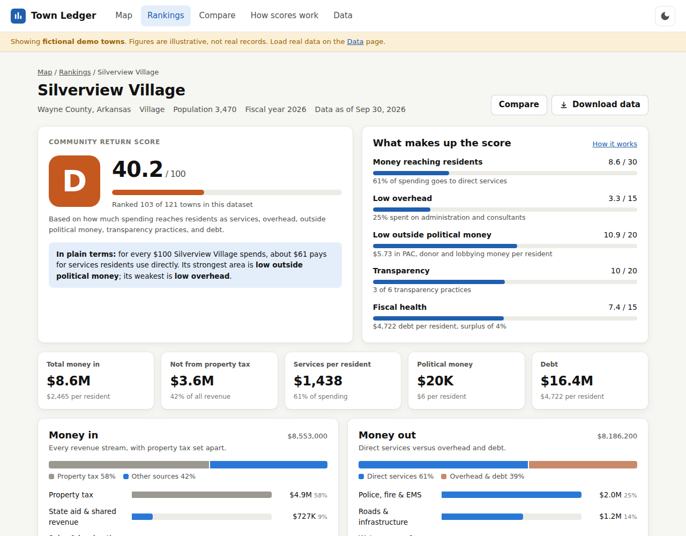

# Town Ledger

Plain-language bookkeeping for U.S. towns and townships. Town Ledger shows where a town's money comes from (including everything besides property tax), where it goes, and what political money flows around local officials. It then grades how well that money comes back to residents.



## Features

- **Interactive map.** Every town appears as a dot (or a heat layer), colored by how effectively it spends on residents. You can color it by the overall score, service dollars per resident, share of spending on services, political money per resident, or reliance on revenue other than property tax.
- **Town report card.** Each town gets a letter grade and a Community Return Score out of 100, with a plain-English breakdown of each part of the score.
- **Money in.** Every revenue stream: property tax, sales tax, state aid, federal grants, fees, utility charges, fines and borrowing. Property tax is shown separately.
- **Money out.** Direct services (police, fire, roads, water, parks, health) shown against overhead (administration, consultants, debt).
- **Red flags.** Surveillance tech (Flock license-plate cameras, facial recognition, ShotSpotter), data center contracts, private-developer subsidies and corporate tax breaks are flagged in red and cost points. Known surveillance vendors and data center deals are caught by name even when filed under police or general spending.
- **Corporate lobbying.** Shown inside Money in and Money out, not just beside them: how much corporations spent lobbying and donating, what they got back in tax breaks, and which companies both lobbied or donated and were paid by the town.
- **Political money.** Corporate lobbying, PAC, developer, contractor and union contributions to local officials, plus lobbying the town pays for, with a top-contributors table.
- **Transparency check.** Six good-government practices: budget online, open checkbook, on-time audit, competitive bidding, recorded meetings, and conflict-of-interest disclosures.
- **Ledger.** Individual transactions you can search, filter, sort and export to CSV.
- **Five-year trend** of revenue against spending.
- **Rankings.** A sortable, filterable table of every town, exportable to CSV.
- **Compare.** Up to three towns side by side.
- **Bring your own data.** Import a JSON file in the browser, or build one with the scripts below.
- Light and dark themes, works on phones, no build step, no tracking.

## Run it

```bash
npm start          # http://localhost:8080  (Node 18+, no dependencies to install)
npm test           # engine, ledger, importer tests
```

It's a static site, so any static host works, including GitHub Pages (Settings > Pages > deploy from branch, root folder).

## Data

The app ships with **fictional demo towns** (`data/towns.json`, made by `npm run generate:demo`) so every feature works out of the box. The app shows a banner while demo data is loaded.

To use real figures, build a dataset with the pipeline scripts, then load it on the **Data** page or replace `data/towns.json`:

| Source | Script | What it fills |
|---|---|---|
| [Census Annual Survey of Local Government Finances](https://www.census.gov/programs-surveys/gov-finances.html) | `scripts/import-census-finance.mjs` | Revenue and spending by category |
| [USAspending.gov](https://www.usaspending.gov) | `scripts/fetch-usaspending.mjs` | Federal grants and their ledger entries |
| State or county campaign-finance portal / lobbying registry (CSV export) | `scripts/import-contributions.mjs` | PAC, business and union contributions, corporate lobbying (`contributor_type` "Corporate lobbying"), town-paid lobbying ("Town-paid lobbying"), top donors |
| New Jersey municipal budget / User Friendly Budget (line items as CSV) | `scripts/import-nj-budget.mjs` | Revenue and spending by line, with one ledger row per budget line |
| Town budget, audit (ACFR) and website | edit the JSON | Transparency checks, debt, history, surveillance and data center contracts, corporate tax breaks |

Example:

```bash
node scripts/import-census-finance.mjs --file 2022FinEstDAT.txt --gov-id <14-digit id> \
  --id my-township-pa --name "My Township" --state PA --population 12000 --lat 40.8 --lng -77.7 --year 2022
node scripts/fetch-usaspending.mjs --state PA --city "My Town" --recipient "MY TOWNSHIP" --id my-township-pa --fy 2026
node scripts/import-contributions.mjs --csv contributions.csv --id my-township-pa
# -> data/my-township-pa.json, ready to load on the Data page
```

### New Jersey (all 564 municipalities)

`data/real/nj-<county>.json` holds every NJ town, built from the state's [User Friendly Budget Database](https://datahub.dca.nj.gov/datasets/user-friendly-budget-database) (adopted budgets, net debt, population, history back to 2015) and [NJ ELEC](https://www.njelecefilesearch.com/SearchContributionToEntity) contributions to municipal candidates. Red flags come from the [EFF Atlas of Surveillance](https://atlasofsurveillance.org/) (police license-plate readers, drones, gunshot detection, face recognition), license-plate cameras mapped in OpenStreetMap ([DeFlock](https://deflock.org/)), and a hand-checked list of data center deals and corporate lobbying (`scripts/nj/corporate-deals.json`). Coverage and gaps: [docs/NJ_DATA_STATUS.md](docs/NJ_DATA_STATUS.md).

```bash
node scripts/nj/build-county.mjs --download                      # budget workbook + Census gazetteer
pip install openpyxl && python3 scripts/nj/ufb-to-json.py data/raw/nj/ufb-database.xlsm data/raw/nj/ufb.json
node scripts/nj/fetch-elec.mjs --all                              # campaign contributions (cached)
node scripts/nj/build-county.mjs --all
node scripts/nj/red-flags.mjs --download && node scripts/nj/red-flags.mjs   # surveillance, data center deals
node scripts/nj/status.mjs
```

### New York (about 1,525 towns, villages and cities)

`data/real/ny-<county>.json` holds every NY town, village and city that files with the State Comptroller, built from the Comptroller's [Annual Financial Report data](https://wwe1.osc.state.ny.us/localgov/findata/financial-data-for-local-governments.cfm) (actual revenue, spending and debt; history back to 2016), Census 2025 population estimates, and State Board of Elections contribution records on [data.ny.gov](https://data.ny.gov). New York City is not included. Coverage and gaps: [docs/NY_DATA_STATUS.md](docs/NY_DATA_STATUS.md).

```bash
node scripts/ny/download.mjs                       # Comptroller files, Census estimates, gazetteers
python3 scripts/ny/osc-to-json.py                  # condense ~5M rows into data/raw/ny/osc.json
node scripts/ny/fetch-politics.mjs --all           # campaign contributions (cached)
node scripts/ny/build-county.mjs --all && node scripts/ny/status.mjs
node scripts/build-summary.mjs                     # light index the app loads at startup
```

### Pennsylvania (about 2,550 townships, boroughs and cities)

`data/real/pa-<county>.json` holds every PA municipality that files an Annual Audit and Financial Report with the Department of Community and Economic Development, built from DCED's [Statewide Municipal Annual Financial Reports](https://apps.dced.pa.gov/munstats-public/ReportInformation2.aspx?report=StatewideMuniAfr) (actual revenue, spending and debt; history back to 2016) and Census 2025 population estimates. Political money is not scored for Pennsylvania: municipal candidates file with their county board of elections and no statewide database of those filings exists. Coverage and gaps: [docs/PA_DATA_STATUS.md](docs/PA_DATA_STATUS.md).

```bash
node scripts/pa/download.mjs
pip install xlrd && python3 scripts/pa/afr-to-json.py
node scripts/pa/build-county.mjs --all && node scripts/pa/status.mjs
node scripts/build-summary.mjs
```

### Connecticut (all 169 towns and the City of Groton)

`data/real/ct-<planning-region>.json` holds every CT town, grouped by the nine planning regions the Census uses in place of counties. Figures come from the Office of Policy and Management's Municipal Fiscal Indicators on data.ct.gov: [financial statements](https://data.ct.gov/d/d6pe-dw46) (actual general-fund revenue, spending and debt), the [Uniform Chart of Accounts](https://data.ct.gov/d/e2qt-k238) (spending by department) and [town data](https://data.ct.gov/d/ej6f-y2wf) (history back to 2014). Connecticut towns pay for their schools, so school spending is on each report but left out of the services and overhead shares. Political money comes from each town's party town committees as filed with the [State Elections Enforcement Commission](https://seec.ct.gov/Portal/eCRIS/CurPreYears); candidates for town office file with their town clerk and are not included. Coverage and gaps: [docs/CT_DATA_STATUS.md](docs/CT_DATA_STATUS.md).

```bash
node scripts/ct/download.mjs
node scripts/ct/fetch-seec.mjs                     # town party committee receipts
node scripts/ct/build-county.mjs --all && node scripts/ct/status.mjs
node scripts/build-summary.mjs
```

### Massachusetts (all 351 cities and towns)

`data/real/ma-<county>.json` holds every MA city and town, built from the Division of Local Services' [Schedule A general fund reports](https://www.mass.gov/lists/schedule-a-reports-revenues-expenditures-and-more) (actual revenue and spending by function, history back to 2014), DLS [local receipts](https://dls-gw.dor.state.ma.us/reports/rdPage.aspx?rdReport=TaxRateRecap.PAGE3.LocalReceiptsAct_vs_Est) (to separate excise taxes from property tax) and [long-term debt](https://dls-gw.dor.state.ma.us/reports/rdPage.aspx?rdReport=Dashboard.Cat_6_Reports.LongTermDebt351), and Census 2025 population estimates. Like Connecticut, Massachusetts towns pay for their schools, so school spending is on each report but left out of the services and overhead shares. Political money comes from the [Office of Campaign and Political Finance](https://www.ocpf.us/): union and PAC contributions to party ward, town and city committees and to candidates for mayor and city council. Coverage and gaps: [docs/MA_DATA_STATUS.md](docs/MA_DATA_STATUS.md).

```bash
node scripts/ma/download.mjs                       # DLS Schedule A, receipts, debt; Census files
pip install openpyxl && python3 scripts/ma/dls-to-json.py
node scripts/ma/fetch-ocpf.mjs                     # campaign contributions (cached)
node scripts/ma/build-county.mjs --all && node scripts/ma/status.mjs
node scripts/build-summary.mjs
```

### Rhode Island (all 39 cities and towns)

`data/real/ri-<county>.json` holds every RI city and town, built from the Division of Municipal Finance's [Municipal Transparency Portal](https://municipalfinance.ri.gov/municipal-transparency) (audited actual revenue and spending under the state's uniform chart of accounts, history back to FY 2016) and Census 2025 population estimates. School departments report separately, so reports show each town's appropriation to its schools. Debt outstanding is not available, so fiscal health is not scored. Political money comes from the Board of Elections' [ERTS](https://ricampaignfinance.com/RIPublic/Contributions.aspx): PAC contributions to local candidates and party city and town committees. The portal is behind a browser check, so `download.mjs` uses Playwright when installed (`npm i playwright`); otherwise save "MTP All Data" by hand as `data/raw/ri/mtp.csv`. Coverage and gaps: [docs/RI_DATA_STATUS.md](docs/RI_DATA_STATUS.md).

```bash
node scripts/ri/download.mjs                       # transparency portal data; Census files
node scripts/ri/fetch-erts.mjs                     # campaign contributions and filers (cached)
node scripts/ri/build-county.mjs --all && node scripts/ri/status.mjs
node scripts/build-summary.mjs
```

### Maryland (all reporting municipalities and Baltimore City)

`data/real/md-<county>.json` holds every Maryland municipality that reported to the Department of Legislative Services, and Baltimore City, from DLS's [Local Government Finances in Maryland](https://dls.maryland.gov/budget/local-finances/) (actual revenue by source, spending by function and public debt, reconciled to audits; FY 2021 on) and Census 2025 population estimates. The reports are PDFs; `lgf-to-json.py` reads their tables with pdfplumber. Counties run schools and most services, and municipal candidates file campaign reports locally, so political money is not scored. Coverage and gaps: [docs/MD_DATA_STATUS.md](docs/MD_DATA_STATUS.md).

```bash
node scripts/md/download.mjs                       # DLS reports (PDF); Census files
pip install pdfplumber && python3 scripts/md/lgf-to-json.py
node scripts/md/build-county.mjs --all && node scripts/md/status.mjs
node scripts/build-summary.mjs
```

### Virginia (counties, independent cities and reporting towns)

`data/real/va-<county-or-city>.json` holds Virginia's counties (each with its towns) and independent cities, from the Auditor of Public Accounts' [Comparative Report of Local Government Revenues and Expenditures](https://www.apa.virginia.gov/local-government/reports?type=comparative-reports) (actual revenue, spending by function, capital, debt service, enterprise funds and debt from audited statements; FY 2023 on) and Census 2025 population estimates. Virginia has no townships, so counties are listed with cities and towns. Political money comes from the Department of Elections' [bulk campaign finance files](https://apps.elections.virginia.gov/SBE_CSV/CF/): business, union and PAC contributions to local candidates. Coverage and gaps: [docs/VA_DATA_STATUS.md](docs/VA_DATA_STATUS.md).

```bash
node scripts/va/download.mjs                       # APA comparative reports (Excel); Census files
pip install openpyxl && python3 scripts/va/apa-to-json.py
node scripts/va/fetch-elect.mjs                    # campaign finance (cached)
curl -o data/raw/va/zcta-county.txt https://www2.census.gov/geo/docs/maps-data/data/rel2020/zcta520/tab20_zcta520_county20_natl.txt
node scripts/va/build-county.mjs --all && node scripts/va/status.mjs
node scripts/build-summary.mjs
```

### North Carolina (counties, cities, towns and villages)

`data/real/nc-<county>.json` holds each North Carolina county and the municipalities whose people mostly live in it, from the Annual Financial Information Report each government files with the Local Government Commission on the Census Bureau's template, as published in the Census Bureau's [individual unit files](https://www.census.gov/programs-surveys/gov-finances.html) (actual revenue, spending by function, capital, debt service, utilities and debt; FY 2022 for every government, a sample in FY 2023 and 2024), and Census 2025 population estimates. Units whose figures the Census mostly estimated are left out. Political money comes from the State Board of Elections' [transaction search](https://cf.ncsbe.gov/CFTxnLkup/): PAC, union and other organizational contributions to county and municipal candidates. Coverage and gaps: [docs/NC_DATA_STATUS.md](docs/NC_DATA_STATUS.md).

```bash
node scripts/nc/download.mjs                       # Census unit files, population, gazetteers, ZIP areas
node scripts/nc/fetch-ncsbe.mjs                    # campaign finance (cached)
node scripts/nc/build-county.mjs --all && node scripts/nc/status.mjs
node scripts/build-summary.mjs
```

### South Carolina (counties, cities and towns)

`data/real/sc-<county>.json` holds each South Carolina county and the municipalities whose people mostly live in it, from what each government reported to the Census Bureau's [Annual Survey of State and Local Government Finances](https://www.census.gov/programs-surveys/gov-finances.html) (individual unit files: actual revenue, spending by function, capital, debt service, utilities and debt; FY 2022 for every government, a sample in FY 2023 and 2024) and Census 2025 population estimates. Units whose figures the Census mostly estimated, or that are incomplete, are left out, so about half of the municipalities are listed. School districts are separate governments. Political money comes from the State Ethics Commission's [public contribution search](https://ethicsfiling.sc.gov/public/campaign-reports/contributions): business, union and PAC contributions to county and municipal candidates, placed by the office sought. Coverage and gaps: [docs/SC_DATA_STATUS.md](docs/SC_DATA_STATUS.md).

```bash
node scripts/sc/download.mjs                       # Census unit files, population, gazetteers
node scripts/sc/fetch-ethics.mjs                   # campaign finance (cached)
node scripts/sc/build-county.mjs --all && node scripts/sc/status.mjs
node scripts/build-summary.mjs
```

### Georgia (counties, consolidated governments, cities and towns)

`data/real/ga-<county>.json` holds each Georgia county (or consolidated city-county government) and the cities whose people mostly live in it, from the Report of Local Government Finance each government files with the Department of Community Affairs ([viewer](https://apps.dca.ga.gov/RLGF/Default.aspx); actual revenue by UCOA account, spending by function including capital, enterprise funds, payments to other governments and debt, from audited figures where available; FY 2022 on) and Census 2025 population estimates. School districts are separate governments. Local candidates file campaign reports with their county or city, so political money is not scored. Coverage and gaps: [docs/GA_DATA_STATUS.md](docs/GA_DATA_STATUS.md).

```bash
node scripts/ga/download.mjs                       # DCA reports (Excel); Census files
pip install xlrd openpyxl && python3 scripts/ga/rlgf-to-json.py
node scripts/ga/build-county.mjs --all && node scripts/ga/status.mjs
node scripts/build-summary.mjs
```

### Florida (counties, cities, towns and villages)

`data/real/fl-<county>.json` holds each Florida county and the municipalities whose people mostly live in it (Jacksonville, consolidated with Duval County, heads Duval's file), from the Annual Financial Report each government files with the Department of Financial Services, as compiled by the Office of Economic and Demographic Research ([counties](https://www.edr.state.fl.us/Content/local-government/data/revenues-expenditures/cntyfiscal.cfm), [municipalities](https://www.edr.state.fl.us/Content/local-government/data/revenues-expenditures/munifiscal.cfm): actual revenue and spending by account code and fund type; FY 2022 on) and Census 2025 population estimates. School districts are separate governments. Debt outstanding is not in the EDR data, so fiscal health is not scored, and local candidates file campaign reports with their county or city, so political money is not scored. Coverage and gaps: [docs/FL_DATA_STATUS.md](docs/FL_DATA_STATUS.md).

```bash
node scripts/fl/download.mjs                       # EDR workbooks (Excel); Census files
pip install openpyxl && python3 scripts/fl/edr-to-json.py
node scripts/fl/build-county.mjs --all && node scripts/fl/status.mjs
node scripts/build-summary.mjs
```

### Delaware (counties, cities and towns)

`data/real/de-<county>.json` holds each Delaware county and the municipalities whose people mostly live in it, from what each government reported to the Census Bureau's [Annual Survey of State and Local Government Finances](https://www.census.gov/programs-surveys/gov-finances.html) (individual unit files, the same mapping as North and South Carolina; FY 2022 for every government, a sample in FY 2023 and 2024) and Census 2025 population estimates. Delaware has no statewide compilation of local finances, and the Census estimated rather than received Kent County's, Wilmington's and Dover's figures, so those are not listed. Political money comes from the Department of Elections' [Campaign Finance Reporting System](https://cfrs.elections.delaware.gov/Public/ViewReceiptsMain): business, union and PAC contributions to county candidates and to municipal candidates who raise more than $5,000, placed by committee. Coverage and gaps: [docs/DE_DATA_STATUS.md](docs/DE_DATA_STATUS.md).

```bash
node scripts/de/download.mjs                       # Census unit files, population, gazetteers
NODE_PATH=$(npm root -g) node scripts/de/fetch-cfrs.mjs   # campaign finance (Playwright; cached)
node scripts/de/build-county.mjs --all && node scripts/de/status.mjs
node scripts/build-summary.mjs
```

### New Hampshire (counties, cities and towns)

`data/real/nh-<county>.json` holds each New Hampshire county and its cities and towns, from what each government reported to the Census Bureau's [Annual Survey of State and Local Government Finances](https://www.census.gov/programs-surveys/gov-finances.html) (individual unit files, the same mapping as the Carolinas and Delaware; the Census counts New Hampshire towns as township governments) and Census 2025 population estimates. Towns collect the school district's, county's and state education tax shares on the same bill; where a town reported the whole levy as its own, only the town's share is kept, and the few towns that filed their school and county assessments as their own spending have those left out (`scripts/common/levy.mjs`; New Hampshire, Vermont and Maine share `scripts/common/town-census-build.mjs`). The Census estimated rather than received about 100 governments' figures, including Concord's and Portsmouth's, so those are not listed. Political money is not scored: local candidates file with their town or city clerk. Coverage and gaps: [docs/NH_DATA_STATUS.md](docs/NH_DATA_STATUS.md).

```bash
node scripts/nh/download.mjs                       # Census unit files, population, gazetteers
node scripts/nh/build-county.mjs --all && node scripts/nh/status.mjs
node scripts/build-summary.mjs
```

### Vermont (counties, cities, towns and villages)

`data/real/vt-<county>.json` holds each Vermont county and its cities, towns and incorporated villages, built the same way as New Hampshire from the Census unit files and Census 2025 population estimates. Towns collect the state education tax and the county tax on the same bill, so where a town reported the whole levy as its own, only the town's share is kept; villages are a second layer inside a town and are listed separately. The Census estimated rather than received about 120 governments' figures, including Bennington and Washington Counties'. Political money is not scored: local candidates do not file with the state. Coverage and gaps: [docs/VT_DATA_STATUS.md](docs/VT_DATA_STATUS.md).

```bash
node scripts/vt/download.mjs
node scripts/vt/build-county.mjs --all && node scripts/vt/status.mjs
node scripts/build-summary.mjs
```

### Maine (counties, cities, towns and plantations)

`data/real/me-<county>.json` holds each Maine county and its cities, towns and plantations, built the same way as New Hampshire. Towns collect their school unit's assessment and the county tax on the same bill, handled as in New Hampshire. The Census estimated rather than received over 200 governments' figures, including York County's. Political money is not scored: local candidates file with their municipal clerk. Coverage and gaps: [docs/ME_DATA_STATUS.md](docs/ME_DATA_STATUS.md).

```bash
node scripts/me/download.mjs
node scripts/me/build-county.mjs --all && node scripts/me/status.mjs
node scripts/build-summary.mjs
```

The app loads `data/real/summary.json` (every real town without ledgers and history) at startup and fetches a county's full file only when a town report is opened. Re-run `node scripts/build-summary.mjs` after any county build or `scripts/nj/red-flags.mjs` run.

Real towns go in `data/real/` and are listed in `data/real/index.json`. The app loads them next to the demo towns, marks them **Public-record data**, and lets you filter to them on the map and rankings.

See [docs/DATA_SCHEMA.md](docs/DATA_SCHEMA.md) for every field and [docs/METHODOLOGY.md](docs/METHODOLOGY.md) for how scores are calculated.

## Project layout

```
index.html, css/, js/app.js     app shell, styles, router
js/views/                       map, town report, rankings, compare, method, data
js/engine/                      pure scoring + ledger logic (shared by app, scripts, tests)
js/charts.js                    small SVG chart helpers
data/towns.json                 demo dataset
scripts/                        demo generator, real-data importers, dev server
tests/                          node --test suite
vendor/                         Leaflet 1.9.4 and Leaflet.heat 0.2.0 (BSD-2-Clause)
```

Map tiles come from CARTO with OpenStreetMap data. State outlines (`data/us-states.json`) are built from the [us-atlas](https://github.com/topojson/us-atlas) package (ISC, U.S. Census Bureau boundaries) and show underneath the tiles, so the map stays usable when tiles are unavailable.

## Trust and usability

- Missing figures display as **Not available**, while reported zero stays zero.
  Towns below the grading coverage threshold display **Not graded**. Grades show
  fiscal year, retrieval date, component coverage and available scoring weight.
- **Public-record data** describes provenance, not independent verification.
  Reports and comparisons show financial basis/scope and political period/recipients.
- Compare starts empty, supports three searchable town selectors, and highlights
  winners only where the available measures have compatible reporting context.
- Rankings display 50 results per page; CSV export includes every filtered result
  with availability explanations. Map and rankings list only states in the active
  data filter; unknown measures are excluded from heat and color scales.
- Failed county requests can be retried. Navigation and dataset changes invalidate
  pending report rendering. Public-data loading failures are displayed explicitly.
- The Data page offers **Download summary**, **Download complete records**, and
  **Restore bundled data**. Complete exports hydrate county records and never
  silently omit a failed county. Imported JSON is validated before replacing data.

Run `npm test` for scoring, import, availability, loading, export, and all-county
summary/detail consistency checks. Scoring weights and thresholds are unchanged.
See [release validation](docs/RELEASE_VALIDATION.md) for browser checks and limits.

Next planned work: shareable filters and comparisons, printable reports with
sources, and a coverage explorer. Geographic expansion and methodology changes
remain separate projects.
